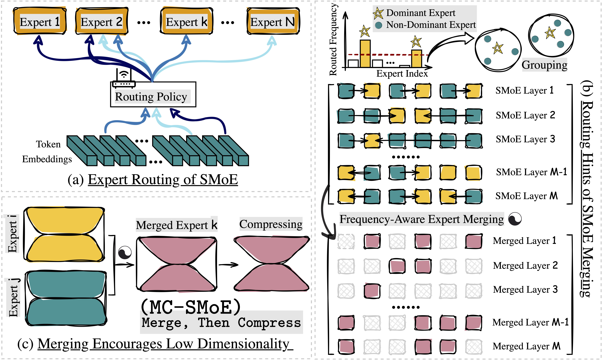

# Merge, Then Compress: Demystify Efficient SMoE with Hints from Its Routing Policy

[](https://opensource.org/licenses/MIT)

Code for the paper "**Merge, Then Compress: Demystify Efficient SMoE with Hints from Its Routing Policy**"

* Authors: [Pingzhi Li](https://pingzhili.github.io/), [Zhenyu Zhang](https://kyriection.github.io/), [Prateek Yadav](https://prateeky2806.github.io/), [Yi-Lin Sung](https://ylsung.github.io/), [Yu Cheng](https://www.linkedin.com/in/chengyu05/), [Mohit Bansal](https://www.cs.unc.edu/~mbansal/) and [Tianlong Chen](https://tianlong-chen.github.io/)
* Paper: [arXiv](https://arxiv.org/abs/2310.01334)

## Overview

Sparsely activated Mixture-of-Experts (SMoE) has shown promise to scale up the learning capacity of neural networks,
however, they have issues like: ($a$) $\textit{High Memory Usage,}$ due to duplication of the network layers into
multiple copies as experts; and ($b$) $\textit{Redundancy in Experts,}$ as common learning-based routing policies suffer
from representational collapse. Therefore, vanilla SMoE models are memory inefficient and non-scalable, especially for
resource-constrained downstream scenarios. In this paper, we ask: _Can we craft a compact SMoE model by consolidating
expert information?_ _What is the best recipe to merge multiple experts into fewer but more knowledgeable experts?_ Our
pilot investigation reveals that conventional model merging methods fail to be effective in such expert merging for
SMoE. The potential reasons are: ($1$) redundant information overshadows critical experts; ($2$) appropriate neuron
permutation for each expert is missing to bring all of them in alignment. To address these challenges, we propose a
novel merging algorithm for SMoE, $\textit{i.e.}$, $\texttt{M-SMoE}$, which leverages routing statistics to guide expert
merging. Specifically, it <ins>starts</ins> with neuron permutation alignment for experts; <ins>then</ins>, dominant
experts and their "group members" are formed based on routing policies; <ins>lastly</ins>, every expert group is merged
into a single expert by utilizing each expert's activation frequency as their weight for merging, thus diminishing the
impact of insignificant experts. Moreover, we draw an interesting observation that our proposed merging promotes a low
dimensionality in the merged expert's weight space, naturally paving the way for additional compression. Hence, our
final method, $\texttt{MC-SMoE}$ ($\textit{i.e.}$, Merge, then Compress SMoE), further decomposes the merged experts
into low-rank and structural sparse alternatives. Extensive experiments across $8$ benchmarks validate the effectiveness
of our proposals. For instance, our $\texttt{MC-SMoE}$ achieves up to $80$% memory and a $20$% FLOPs reduction, with
virtually no loss in performance.




## Setup

```shell
conda create -n mcsmoe python=3.9 -y && conda activate mcsmoe
pip install -r requirements.txt
```


## Usage and Examples

#### Full SMoE fine-tuning

```shell
accelerate launch --config_file static/finetune_config.yaml \
  mcsmoe/finetune-switch-transformers.py \
  --per_device_train_batch_size=8 \
  --per_device_eval_batch_size=64 \
  --gradient_accumulation_steps=1 \
  --num_epochs=20 \
  --no_eval_until_epochs=1 \
  --save_each_epoch=False \
  --preprocessing_num_workers=8 \
  --num_experts=32 \
  --task="copa" \
  --learning_rate=3e-5 \
  --warmup_steps=16 \
  --output_dir="results/copa/switch-32e"
```

#### M-SMoE Expert Permutation Alignment

```shell
python -u mcsmoe/permute-model.py \
  --checkpoint="results/copa/switch-32e" \
  --save_dir="results/copa/switch-32e-permuted" 
```

#### M-SMoE Merging

```shell
accelerate launch --config_file static/finetune_config.yaml \
  mcsmoe/msmoe-merging.py \
  --per_device_train_batch_size=16 \    # ======== training arguments from here ========
  --per_device_eval_batch_size=256 \
  --gradient_accumulation_steps=1 \
  --preprocessing_num_workers=8 \
  --num_epochs=10 \
  --num_eval_steps=100 \
  --learning_rate=3e-5 \
  --warmup_steps=16 \
  --weight_decay=0.01 \
  --kd_temperature=2 \
  --mlm_lambda=1.0 \
  --kd_lambda=0.2 \
  --task="copa" \     # ======== merging arguments from here ========
  --num_samples_for_merging=256 \
  --similarity_base="router-logits" \     # for all available options refer to LEGAL_SIMILARITY_BASES in mcsmoe/merging/grouping.py 
  --num_groups=8 \    # average number of experts per SMoE layer
  --globally_group=True \   # if True, apply adaptive merging ratio for each SMoE layer
  --save_stable_rank=False \    # whether to save stable rank of each expert for analysis
  --encoder_merging_layers="3,5,7,9,11" \   # encoder layer indices to be merged
  --decoder_merging_layers="1,3,5,7,9,11" \   # decoder layer indices to be merged
  --output_dir="results/copa/merged/" \     # M-SMoE checkpoint will be saved here
  --teacher_checkpoint="results/copa/switch-32e-permuted" \    # KD teacher checkpoint, full SMoE
  --student_checkpoint="results/copa/switch-32e-permuted"    # KD student checkpoint, will be merged by M-SMoE
```

#### MC-SMoE Low-rank Compression

```shell
accelerate launch --config_file static/finetune_config.yaml \
  --main_process_port 29510 mcsmoe/losparse-downstream.py \
  --per_device_train_batch_size=16 \     # ======== training arguments from here ========
  --per_device_eval_batch_size=256 \
  --gradient_accumulation_steps=1 \
  --preprocessing_num_workers=8 \
  --num_epochs=50 \
  --num_eval_steps=100 \
  --learning_rate=3e-5 \
  --warmup_steps=50 \
  --weight_decay=0.01 \
  --kd_temperature=2 \
  --mlm_lambda=1.0 \
  --kd_lambda=0.2 \
  --hd_lambda=0.0 \
  --task="copa" \     # ======== compression arguments from here ========
  --output_dir="results/copa/switch-32e-merged-8e-compressed/" \      # MC-SMoE checkpoint will be saved here
  --teacher_checkpoint="results/copa/switch-32e-permuted" \      # KD teacher checkpoint, full SMoE
  --student_checkpoint="results/copa/switch-32e-merged-8e" \     # M-SMoE checkpoint, will be further compressed by MC-SMoE
  --final_threshold=0.10 \      # average remaining ratio of S matrices in compression
  --low_rank_factor=32      # low-rank factor for U, V matrices in compression
```

#### More Examples

Please refer to [scripts/t5](scripts/t5) and [scripts/gpt](scripts/gpt) for more examples (e.g. baselines, ablations).


## Hyper-Parameters

#### General Hyper-Parameters

* Optimizer: AdamW
* Adam $\epsilon$: $1e-6$
* Adam $\beta$: ($0.9$, $0.98$)
* Warm-up steps: $16$
* Weight decay: $0.01$
* LR scheduler: Linear decay
* KD $\alpha$: $0.2$
* KD $T$: $2.0$

#### Task-Specific Hyper-Parameters

|      | **Batch size** | **Learning rate** |
| ---- | -------------- | ----------------- |
| SST-2 | $64$           | $1e-4$            |
| MRPC | $32$           | $5e-5$            |
| MultiRC | $32$           | $3e-5$            |
| COPA | $8$            | $3e-5$            |
| WinoGrande | $32$           | $1e-5$            |
| SQuAD | $16$           | $5e-5$            |
| WikiQA | $32$           | $5e-5$            |
| HotpotQA | $32$           | $1e-4$            |


## Citation

```bibtex
@misc{li2023merge,
      title={Merge, Then Compress: Demystify Efficient SMoE with Hints from Its Routing Policy}, 
      author={Pingzhi Li and Zhenyu Zhang and Prateek Yadav and Yi-Lin Sung and Yu Cheng and Mohit Bansal and Tianlong Chen},
      year={2023},
      eprint={2310.01334},
      archivePrefix={arXiv},
      primaryClass={cs.LG}
}
```

